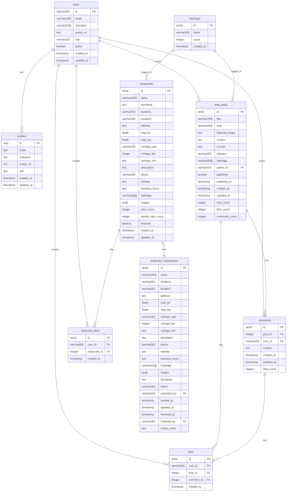

# 데이터베이스 설계

## 1. 엔티티 관계도 (ERD)

## 2. 테이블 설명

### 2.1 사용자 관련 테이블

#### profiles
- 사용자의 프로필 정보를 저장
- Supabase Auth와 연동되어 자동으로 생성됨
- RLS 정책으로 보호됨
- `role` 필드로 관리자 권한 관리

#### users
- 사용자의 상세 정보를 저장
- Firebase Auth와 연동
- `active` 필드로 계정 상태 관리

### 2.2 레스토랑 관련 테이블

#### restaurants
- 승인된 레스토랑 정보 저장
- 위치 정보(lat, lng)로 지도 표시
- 해시태그 배열로 검색 기능 지원
- 조회수와 주간 조회수로 인기 레스토랑 산출

#### restaurant_submissions
- 사용자가 제출한 레스토랑 정보
- 관리자 승인 후 restaurants 테이블로 이동
- 상태(pending, approved, rejected) 관리

### 2.3 블로그 관련 테이블

#### blog_posts
- 블로그 게시글 저장
- SEO를 위한 slug 필드
- 카테고리와 해시태그로 분류
- 조회수, 좋아요수, 댓글수 집계

#### comments
- 블로그 게시글의 댓글
- 좋아요 수 집계
- 작성자 정보 연동

### 2.4 상호작용 테이블

#### likes
- 게시글과 댓글의 좋아요 정보
- CHECK 제약조건으로 중복 방지
- 게시글이나 댓글 중 하나만 참조 가능

#### restaurant_likes
- 레스토랑 좋아요 정보
- 사용자별 즐겨찾기 기능 제공

### 2.5 태그 관리

#### hashtags
- 시스템에서 사용되는 모든 해시태그 관리
- 사용 빈도 카운트
- 레스토랑과 블로그 포스트에서 공유

## 3. 주요 기능별 데이터 흐름

### 3.1 레스토랑 등록 프로세스
1. 사용자가 restaurant_submissions에 정보 제출
2. 관리자가 검토 후 승인/거절
3. 승인 시 restaurants 테이블에 데이터 복사
4. 해시태그 카운트 증가

### 3.2 블로그 시스템
1. 관리자가 blog_posts 작성
2. 사용자가 댓글 작성 (comments)
3. 좋아요 기능으로 인기도 측정
4. 조회수 기반 추천 시스템

### 3.3 사용자 인증
1. Firebase Auth로 기본 인증
2. Supabase profiles로 권한 관리
3. RLS로 데이터 접근 제어

## 4. 주요 이슈 해결 가이드

### 4.1 인증 관련 이슈
- Firebase Auth 설정: `.env` 파일의 Firebase 설정 확인
- 권한 문제: profiles 테이블의 role 필드 확인
- RLS 정책: supabase/migrations의 정책 설정 확인

### 4.2 데이터 동기화 이슈
- 좋아요 카운트 불일치: triggers 확인
- 조회수 집계 오류: increment/decrement 함수 확인
- 해시태그 카운트: increment_hashtag_count 함수 확인

### 4.3 성능 관련 이슈
- 느린 검색: hashtags 인덱스 확인
- 느린 조회: view_count 인덱스 확인
- 이미지 로딩: Firebase Storage 설정 확인

## 5. 확장성 고려사항

### 5.1 데이터베이스 스케일링
- 샤딩 준비: id를 UUID로 설계
- 캐싱: Redis 도입 가능성
- 백업: Supabase 자동 백업 활용

### 5.2 기능 확장
- 리뷰 시스템 추가 가능
- 예약 시스템 통합 가능
- 소셜 기능 확장 가능

### 5.3 보안 강화
- RLS 정책 세분화 가능
- 암호화 필드 추가 가능
- 감사 로그 시스템 도입 가능