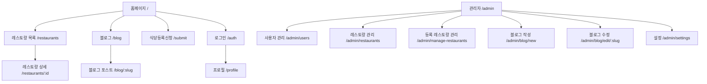

# 페이지 구조 및 라우팅

## 1. 페이지 구조도



## 2. 페이지별 설명

### 2.1 공개 페이지

#### HomePage (/)
- 주요 기능:
  - 지역별 레스토랑 검색
  - 인기 레스토랑 표시
  - 최신 블로그 포스트 표시
- 컴포넌트:
  - HeroSection
  - FeaturedRestaurants
  - FeaturedBlogPosts

#### RestaurantsPage (/restaurants)
- 주요 기능:
  - 레스토랑 검색 및 필터링
  - 무한 스크롤 목록
  - 지도 보기
- 컴포넌트:
  - RestaurantCard
  - PriceRangeSlider
  - NaverMap

#### RestaurantDetailPage (/restaurants/:id)
- 주요 기능:
  - 레스토랑 상세 정보
  - 이미지 갤러리
  - 위치 지도
  - 좋아요 기능
- 컴포넌트:
  - ImageGallery
  - NaverMap
  - ShareModal

#### BlogPage (/blog)
- 주요 기능:
  - 블로그 포스트 목록
  - 카테고리 필터링
  - 해시태그 검색
- 컴포넌트:
  - BlogCard
  - CategoryFilter
  - HashtagCloud

#### BlogPostPage (/blog/:slug)
- 주요 기능:
  - 블로그 포스트 내용
  - 댓글 시스템
  - 좋아요 기능
  - 공유 기능
- 컴포넌트:
  - BlogComment
  - BlogCommentForm
  - ShareModal

#### SubmitRestaurantPage (/submit)
- 주요 기능:
  - 레스토랑 정보 입력
  - 이미지 업로드
  - 위치 정보 입력
- 컴포넌트:
  - ImageUploader
  - LocationPicker
  - SuccessModal

### 2.2 인증 페이지

#### AuthPage (/auth)
- 주요 기능:
  - 소셜 로그인
  - 이메일 로그인
  - 회원가입
- 컴포넌트:
  - LoginForm
  - SignupForm
  - SocialButtons

#### ProfilePage (/profile)
- 주요 기능:
  - 프로필 정보 수정
  - 좋아요한 레스토랑 목록
  - 작성한 댓글 목록
- 컴포넌트:
  - ProfileForm
  - FavoriteRestaurants
  - UserComments

### 2.3 관리자 페이지

#### AdminLayout (/admin/*)
- 공통 기능:
  - 관리자 인증 확인
  - 사이드바 네비게이션
  - 권한 관리
- 컴포넌트:
  - AdminSidebar
  - AdminHeader
  - ProtectedRoute

#### UsersPage (/admin/users)
- 주요 기능:
  - 사용자 목록 조회
  - 사용자 상태 관리
  - 권한 관리
- 컴포넌트:
  - UserTable
  - UserStatusToggle
  - RoleManager

#### RestaurantsPage (/admin/restaurants)
- 주요 기능:
  - 레스토랑 제출 목록
  - 승인/거절 처리
  - 수정 기능
- 컴포넌트:
  - SubmissionList
  - ApprovalButtons
  - EditRestaurantModal

#### ManageRestaurantsPage (/admin/manage-restaurants)
- 주요 기능:
  - 승인된 레스토랑 관리
  - 추천 레스토랑 설정
  - 정보 수정
- 컴포넌트:
  - RestaurantTable
  - FeaturedToggle
  - EditRestaurantModal

#### BlogPostEditorPage (/admin/blog/new, /admin/blog/edit/:slug)
- 주요 기능:
  - 블로그 포스트 작성/수정
  - 이미지 업로드
  - 미리보기
- 컴포넌트:
  - RichTextEditor
  - ImageUploader
  - PreviewPanel

#### SettingsPage (/admin/settings)
- 주요 기능:
  - 해시태그 관리
  - 시스템 설정
  - 통계 확인
- 컴포넌트:
  - HashtagManager
  - SystemSettings
  - StatisticsPanel

## 3. 라우팅 구조

```typescript
// App.tsx의 라우팅 구조
<Router>
  <ScrollToTop />
  <Navbar />
  <Routes>
    {/* 공개 페이지 */}
    <Route path="/" element={<HomePage />} />
    <Route path="/restaurants" element={<RestaurantsPage />} />
    <Route path="/restaurants/:id" element={<RestaurantDetailPage />} />
    <Route path="/blog" element={<BlogPage />} />
    <Route path="/blog/:slug" element={<BlogPostPage />} />
    <Route path="/submit" element={<SubmitRestaurantPage />} />
    <Route path="/auth" element={<AuthPage />} />
    
    {/* 인증 필요 페이지 */}
    <Route 
      path="/profile" 
      element={
        <ProtectedRoute>
          <ProfilePage />
        </ProtectedRoute>
      } 
    />
    
    {/* 관리자 페이지 */}
    <Route
      path="/admin"
      element={
        <ProtectedRoute requireAdmin>
          <AdminLayout />
        </ProtectedRoute>
      }
    >
      <Route path="users" element={<UsersPage />} />
      <Route path="restaurants" element={<AdminRestaurantsPage />} />
      <Route path="manage-restaurants" element={<ManageRestaurantsPage />} />
      <Route path="blog/new" element={<BlogPostEditorPage />} />
      <Route path="blog/edit/:slug" element={<BlogPostEditorPage />} />
      <Route path="settings" element={<SettingsPage />} />
    </Route>
  </Routes>
</Router>
```

## 4. 컴포넌트 재사용 가이드

### 4.1 공통 UI 컴포넌트
- LoadingSpinner: 로딩 상태 표시
- PriceRangeSlider: 가격 범위 선택
- SuccessModal: 성공 메시지 모달
- ShareModal: 공유 기능 모달

### 4.2 레스토랑 관련 컴포넌트
- RestaurantCard: 레스토랑 목록 카드
- ImageGallery: 이미지 갤러리
- NaverMap: 지도 표시

### 4.3 블로그 관련 컴포넌트
- BlogCard: 블로그 포스트 카드
- BlogComment: 댓글 컴포넌트
- BlogCommentForm: 댓글 작성 폼

## 5. 페이지 수정 가이드

### 5.1 새 페이지 추가
1. pages 디렉토리에 페이지 컴포넌트 생성
2. App.tsx에 라우트 추가
3. 필요한 컴포넌트 import
4. 상태 관리 연결

### 5.2 기존 페이지 수정
1. 해당 페이지 컴포넌트 파일 찾기
2. 관련 컴포넌트 확인
3. 상태 관리 로직 확인
4. 변경 사항 적용

### 5.3 레이아웃 수정
1. components/layout 디렉토리 확인
2. Navbar, Footer 등 수정
3. 반응형 디자인 고려
4. 테마 일관성 유지